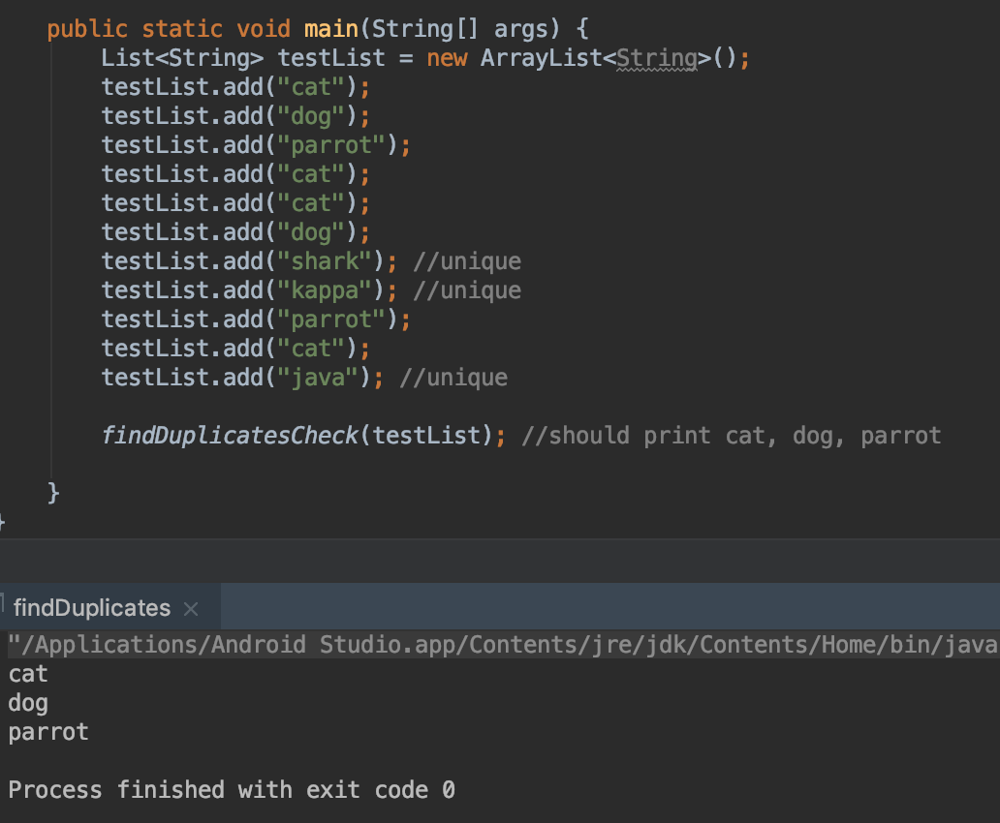
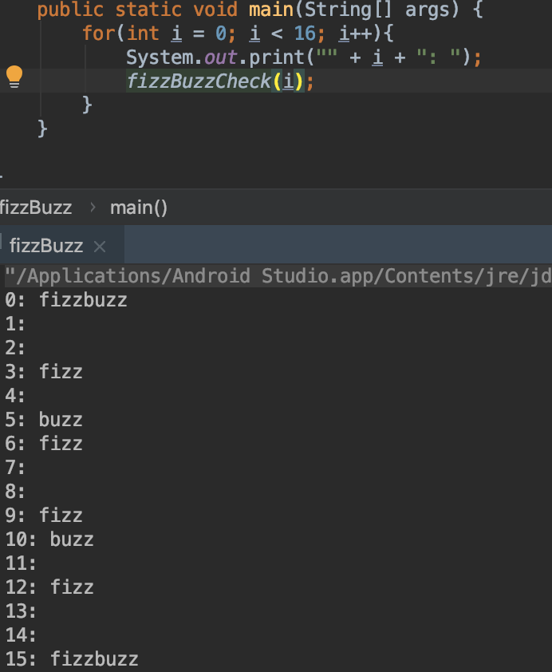
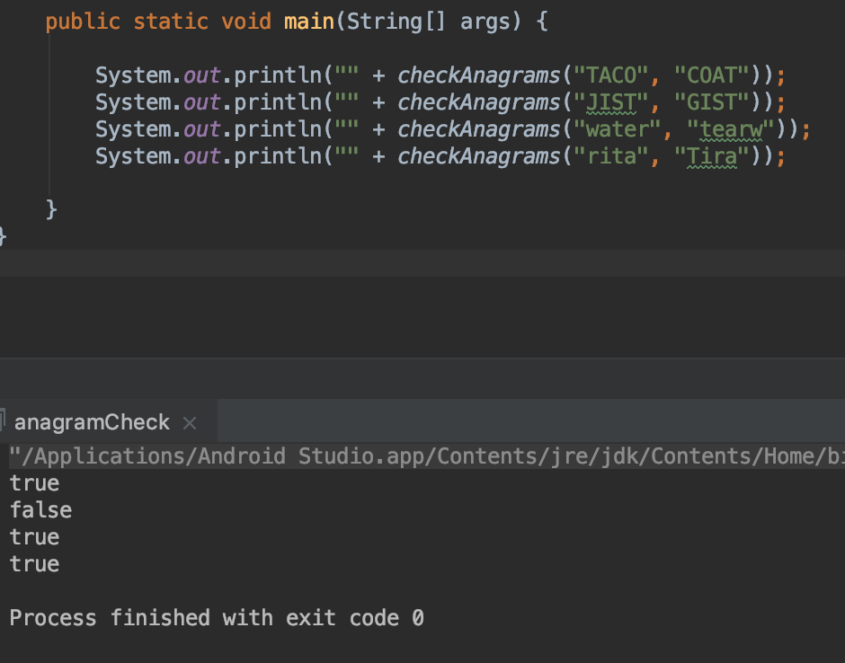
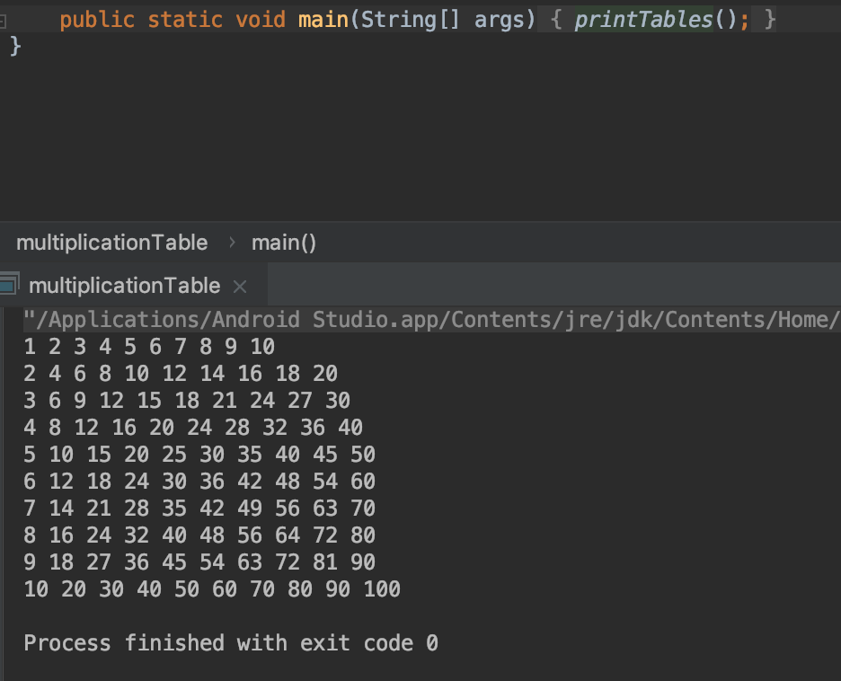

# Week1Daily2JavaIntro

## findDuplicates.java

This class take a List of Strings as an input and aims to print out the duplicate entries within the List.

The function findDuplicatesCheck() take a List of Strings named **strings** as input and creates a copy of the **strings** List named **listCopy**. **listCopy** that will serve as a manipulatable data structure to remove any unique entries present within **strings** and check for duplicate strings.
Then, the function iterates through the entries of **strings**. For each entry **s**, we remove its copy from **listCopy**; this ensures that any unique values are removed from **listCopy**.
Afterwards, the function uses the **contains** method for ArrayLists to check for duplicates of **s**. If any duplicate strings are found, the string is printed on a new line and any other instance of the string is removed from **listCopy** in the case of many duplicate strings.
By the end of the iteration, **listCopy** should be empty and the duplicate strings are should be printed to the console.

## palindromeCheck.java

This class uses a function named checkPalindrome which takes in a String **word** as an input and aims to determine whether or not **word** is a palindrome. If **word** is a palindrome, checkPalindrome() returns **true**, otherwise checkPalindrome() returns **false**.

First, the function uses an int primitive type to store the length of the String input in **wordLength**.
Then, the function iterates through **word** starting from index 0 and ending at index **wordLength**/2. Each iteration compares the characters at each end of **word** using the iteration counter and (**wordLength** - the iteration counter) as indices in **word**.
If any of these characters do not match, then **word** is not a palindrome and **false** is returned. Otherwise, **word** is a palindrome and **true** is returned.

## fizzBuzz.java

This class uses a function named FizzBuzzCheck() which takes an int primitive type and determines whether it is a multiple of 3 and 5.
FizzBuzzCheck uses two if statements that always execute.. The first if statement checks if the integer input is divisible by 3 and print fizz if it is true.
The second if state checks if the integer input is divisible by 5 and prints out buzz if it is true.
Integer inputs that are divisible by both 3 and 5 both fizz and buzz are printed.

## anagramCheck.java

This class uses a function named checkAnagrams() which takes in two Strings **word1** and *word2** and aims to determine whether the two Strings are anagrams. If the inputs are anagrams then checkAnagrams() returns **true**, otherwise it returns **false**.
First, the function converts **word1** and **word2** to lowercase to mitigate the effects of capitalization.
Next, the two strings are converted into character arrays.
Then, the Arrays.sort() method from the java.util library is used to sort the converted character arrays.
Lastly, the Arrays.equals() method from the same library is used to compare the sorted character arrays and the result is returned.

## multiplicationTable.java

This class uses a function named printTables() to create a 2-dimensional array, fill it with the a multiplication table from 1 to 10, and print the whole array out onto the console.
First, the function initializes the 2-dimensional array to be a size of [10][10].
Then, it uses two for-loops that both iterate from 1 to 10. The indicies of the array are used as the multiples for the value filling that specific index of the array.
Finally, values in the 2-dimensional array are printed out.

